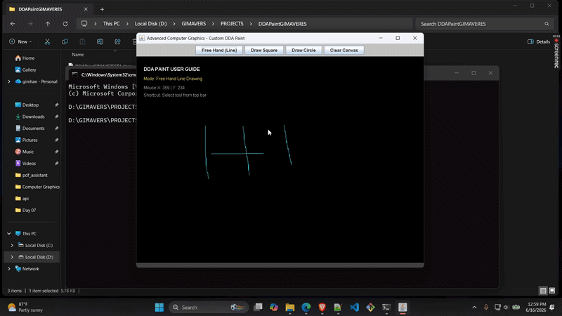

# Custom Computer Graphics Paint Application 🖌️

A lightweight interactive paint application built with Java Swing and AWT. It demonstrates core computer-graphics algorithms through direct pixel manipulation with a `BufferedImage` canvas.



## Features

- **Free-hand drawing** using the Digital Differential Analyzer (DDA) line algorithm.
- **Square drawing** using four DDA-rendered edges.
- **Circle drawing** using the Midpoint Circle Algorithm and eight-way symmetry.
- **Interactive HUD** with the selected tool and mouse coordinates.
- **Clear canvas** control for starting a new drawing.

## Tech Stack

- Java 17+
- Java Swing and AWT
- `BufferedImage` pixel buffer

## Run Locally

### Prerequisite

Install a Java Development Kit (JDK) 17 or newer.

### Steps

```bash
git clone https://github.com/GimhanDisanayaka/Custom-Paint-Application.git
cd Custom-Paint-Application
javac DDAPaintGIMAVERES.java
java DDAPaintGIMAVERES
```

## Future Improvements

- Add colour selection and brush-size controls.
- Add undo and redo support.
- Add image export and additional drawing tools.

## License

This project is available under the MIT License.
